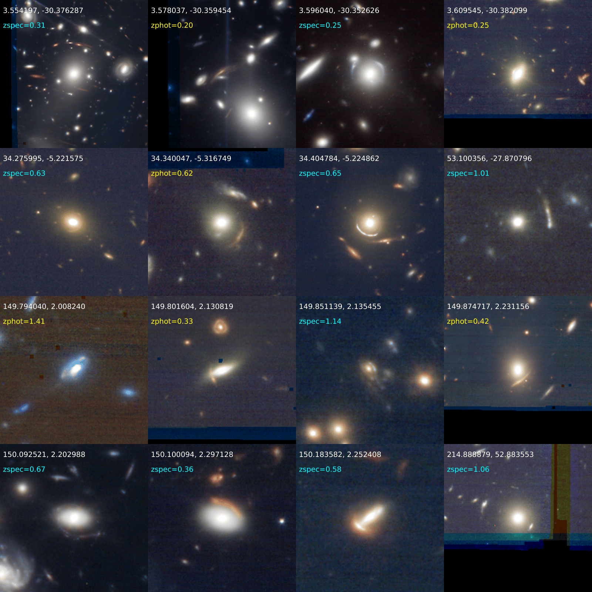

<h1 align="center">AnomalyMatch for James Webb Space Telescope</h1>

<p align="center">
  <a href="https://github.com/esa/AnomalyMatch">
    
  </a>
</p>

This repository builds on top of [AnomalyMatch](https://github.com/esa/AnomalyMatch) and is focused on discovering gravitational lenses in JWST.

## Example Output

<p align="center">
  
</p>

*Mosaic of lenses given a Grade A found in this project, with their measurement method specified (spectroscopic vs photometric).*

# Setup

Install AnomalyMatch as a regular dependency first, then install the extra packages required by this repo.

Create and activate an environment:

```bash
conda create -n am-jwst python=3.11
conda activate am-jwst
pip install git+https://github.com/esa/AnomalyMatch.git
python -m pip install -r requirements.txt
```

# Workflow

This repository is the JWST-specific data-preparation layer around AnomalyMatch. It does the following:

1. scans JWST NIRCam Stage 3 image products and external source catalogues available on ESA Datalabs
2. matches ASTRODEEP and COSMOS catalogue sources with these JWST footprints
3. builds 4-filter RGB cutouts around those matched sources
4. package the cutouts into formats that are convenient for model training and prediction
5. use AnomalyMatch on the resulting cutout dataset

These steps use the following predefined configuration:

| Parameter | Value | Meaning |
|-----------|---------------|---------|
| `JWST_FILTERS` | `['f115', 'f150', 'f277', 'f444']` | The four NIRCam filters used here. If one or more filters are missing for a product, that product is skipped in the main pipeline. |
| `MIN_CUTOUT_SIZE` | `12` | Minimum allowed cutout radius size in pixels resulted from Source Extractor segmentation area. |
| `CUTOUT_FACTOR` | `3.5` | Factor applied to the source-derived radius for the cutout extraction window. |
| `CUTOUT_RES` | `224` | Final resized image resolution used for training. |
| `JWST_OPT_RES_NIRCam_SHORT` | `0.0317` arcsec/pixel | Pixel scale used for short-wavelength NIRCam channels. |
| `JWST_OPT_RES_NIRCam_LONG` | `0.063` arcsec/pixel | Pixel scale used for long-wavelength NIRCam channels. |

There are two ways to get the inputs for this workflow:

- download the prepared shared tables from Zenodo with `fetch_esac_data.sh`
- regenerate them locally from the raw FITS and catalogue files with the follosign script:

```bash
python run_jwst_pipeline.py
```

### 5. Inspection and Model Work

Python scripts are available for the main interactive workflows:
- `scripts.py`: exploratory utilities, including de-duplication of nearby labelled lenses
- `model_training.py`: training and evaluation workflow on the prepared JWST cutout dataset

The original notebooks are still available for exploratory work:
- `scripts.ipynb`
- `model_training.ipynb`
